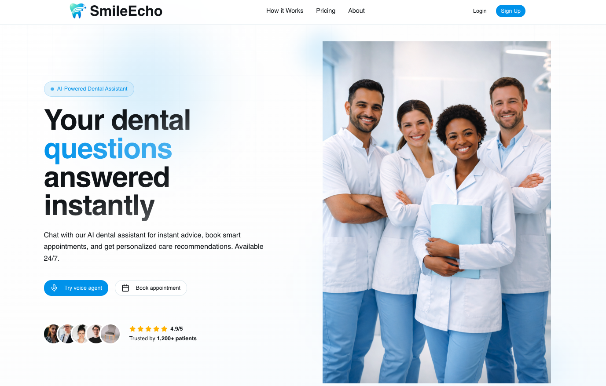
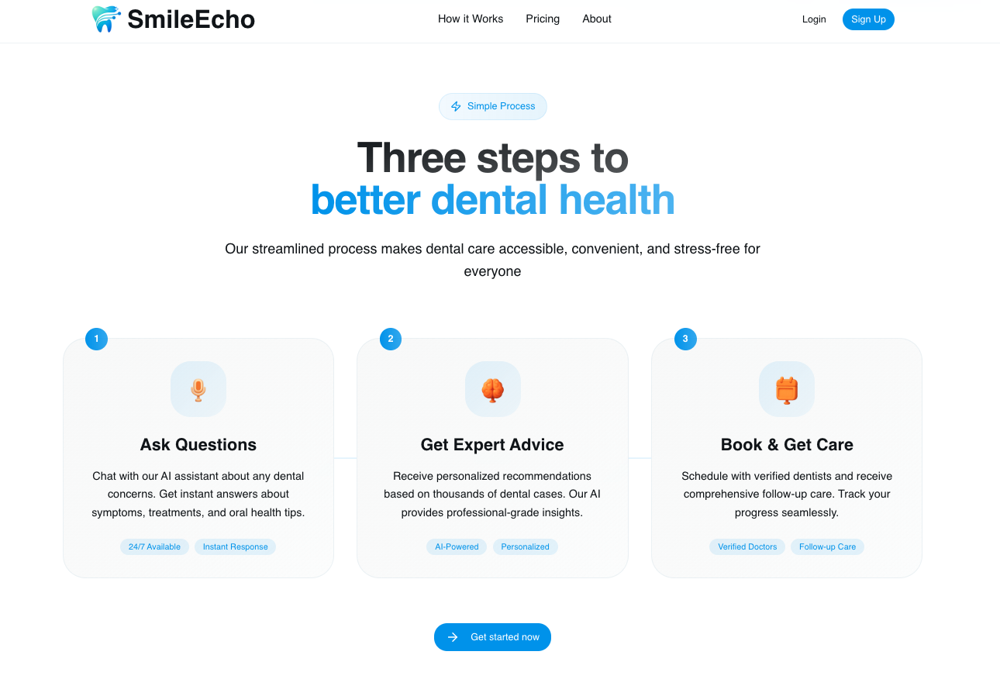
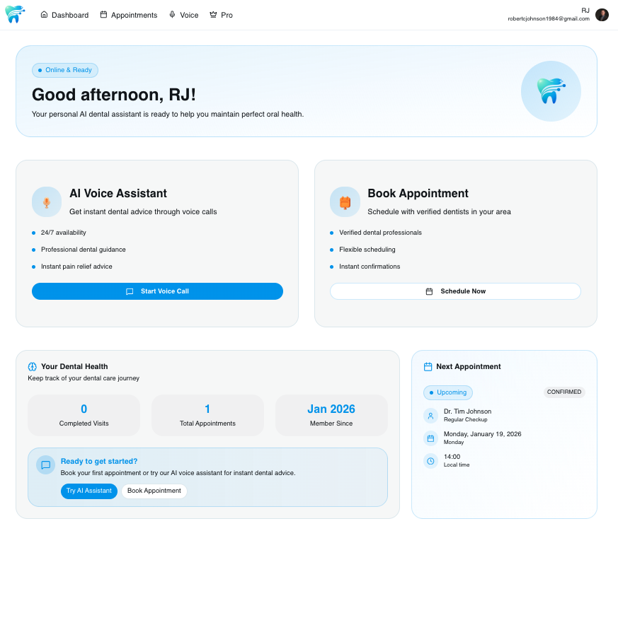
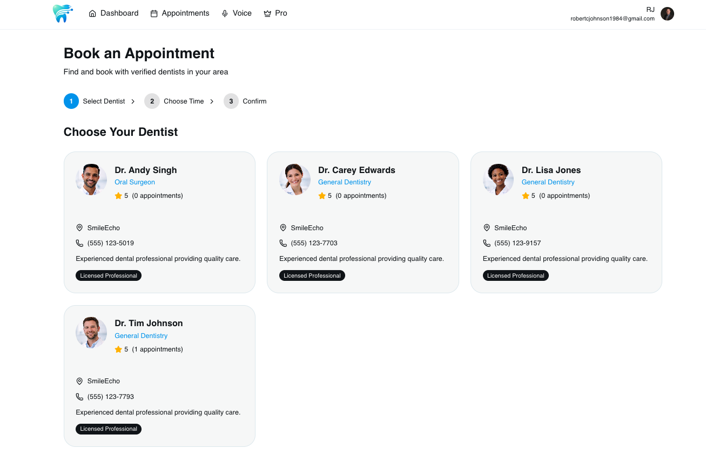
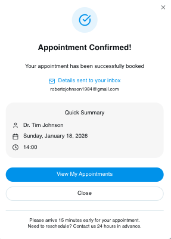
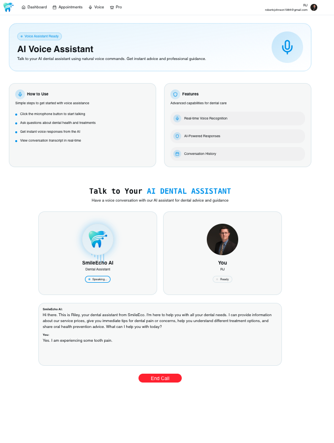
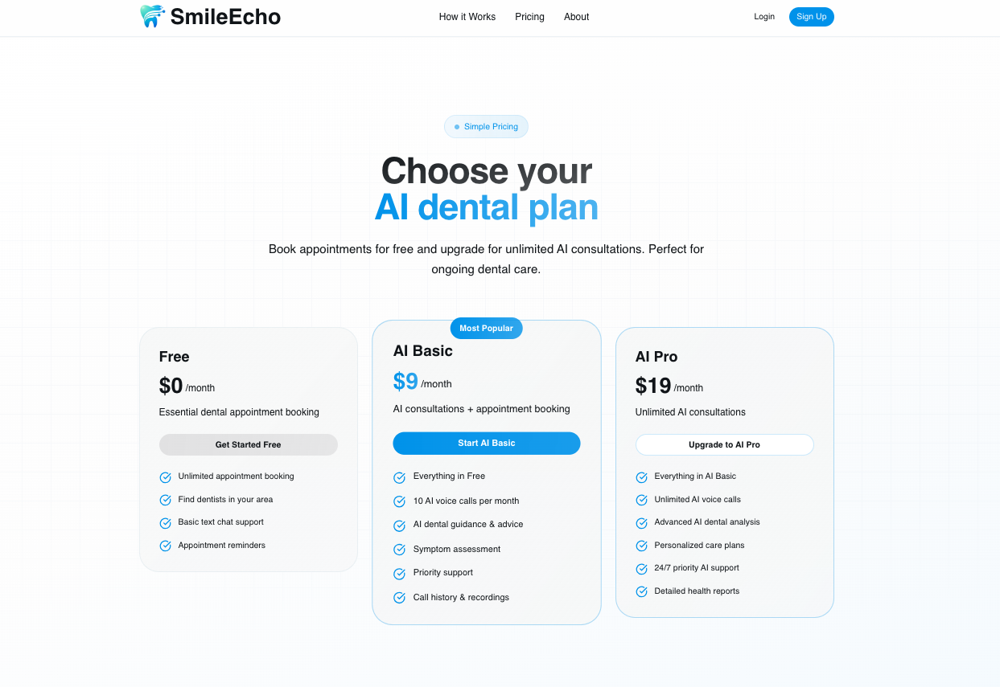

# 🦷 SmileEcho — AI Dental Assistant SaaS


SmileEcho is a modern dental care SaaS that combines AI voice assistance, real-time dental guidance, appointment booking, and subscription billing into a seamless patient experience. Patients can ask dental questions, book verified dentists, and speak with an AI dental assistant, while admins manage appointments from a centralized dashboard.

🌐 **Live Demo:** https://ai-dental-assistant-saas.vercel.app/

---

## 🚀 Tech Stack

- ⚛️ **Next.js (App Router)**
- 🧠 **TypeScript**
- 🎨 **Tailwind CSS**
- 🧩 **shadcn/ui + tweakcn**
- 🔐 **Clerk** (Authentication + Billing)
- 🗄️ **PostgreSQL**
- ⚡ **TanStack Query**
- 🗣️ **Vapi AI Voice Agent**
- 📧 **Resend** (Emails & Invoices)
- 🤖 **CodeRabbit** (PR Optimization)
- ☁️ **Vercel** (Deployment)

---

## 🔑 Authentication & Security

- Google + Email/Password authentication
- 6-digit email verification
- Secure route protection
- Subscription-based feature gating

---

## 💳 Subscriptions & Billing

- Free plan + 2 paid plans
- AI Voice Agent available on Pro plans
- Smart subscription upgrades (pay only the difference)
- Automatic invoice delivery via email
- Clerk-powered Stripe billing

---

## 🔋 Core Features

👉 AI Dental Assistant (Text + Voice)  
👉 Real-time AI Voice Calls (Vapi)  
👉 24/7 Dental Q&A  
👉 Appointment Booking System  
👉 3-Step Booking Flow (Dentist → Service & Time → Confirm)  
👉 Verified Dentists  
👉 Appointment Confirmation Emails  
👉 Admin Dashboard for Appointment Management  
👉 Conversation History  
👉 Fully responsive, mobile-first UI  

---

## 🖼️ Screenshots

### 🏠 Landing & How It Works

| Home | How It Works |
|-----|--------------|
|  |  |

### ❓ Ask Anything & Dashboard

| Ask Anything Dental | User Dashboard |
|---------------------|----------------|
|  |  |

### 📅 Booking & Confirmation

| Book Appointment | Appointment Confirmed |
|------------------|------------------------|
|  |  |

### 🗣️ AI Voice Assistant & Pricing

| AI Voice Assistant | Pricing Plans |
|--------------------|---------------|
|  |  |

---

## 🧪 Environment Variables

Create a `.env.local` file in the project root:

```env
# Clerk Authentication
NEXT_PUBLIC_CLERK_PUBLISHABLE_KEY=your_clerk_publishable_key
CLERK_SECRET_KEY=your_clerk_secret_key

# Database
DATABASE_URL=your_postgres_database_url

# Vapi AI Voice Agent
NEXT_PUBLIC_VAPI_ASSISTANT_ID=your_vapi_assistant_id
NEXT_PUBLIC_VAPI_API_KEY=your_vapi_api_key

# Admin Access
ADMIN_EMAIL=your_admin_email

# Email (Resend)
RESEND_API_KEY=your_resend_api_key

# App URL
NEXT_PUBLIC_APP_URL=your_app_url
```

⚠️ Never commit `.env.local` to version control.

---

## 🤸 Quick Start

### Prerequisites

- Node.js 18+
- npm or pnpm
- PostgreSQL database

---

### Clone the Repository

```bash
git clone https://github.com/johnsonr84/ai-dental-assistant-saas.git
cd ai-dental-assistant-saas
```

---

### Install Dependencies

```bash
npm install
```

---

### Run Locally

```bash
npm run dev
```

Open:

```
http://localhost:3000
```

---

## 🧠 How It Works

1. User signs up and verifies email  
2. User asks dental questions or starts AI voice call  
3. User books an appointment through the guided 3-step flow  
4. Admin manages appointments in the dashboard  
5. Confirmation emails and invoices are sent automatically  

---

## 🛠 Admin Dashboard

- View upcoming appointments
- Confirm or cancel bookings
- Manage subscriptions
- Monitor Pro feature usage

---

## ⚠️ Disclaimer

SmileEcho is for educational and demonstration purposes only and is **not a replacement for professional dental care**.

---

## 👨‍💻 Author

**Robert Johnson**  
Full-Stack & AI Engineer  
GitHub: https://github.com/johnsonr84

